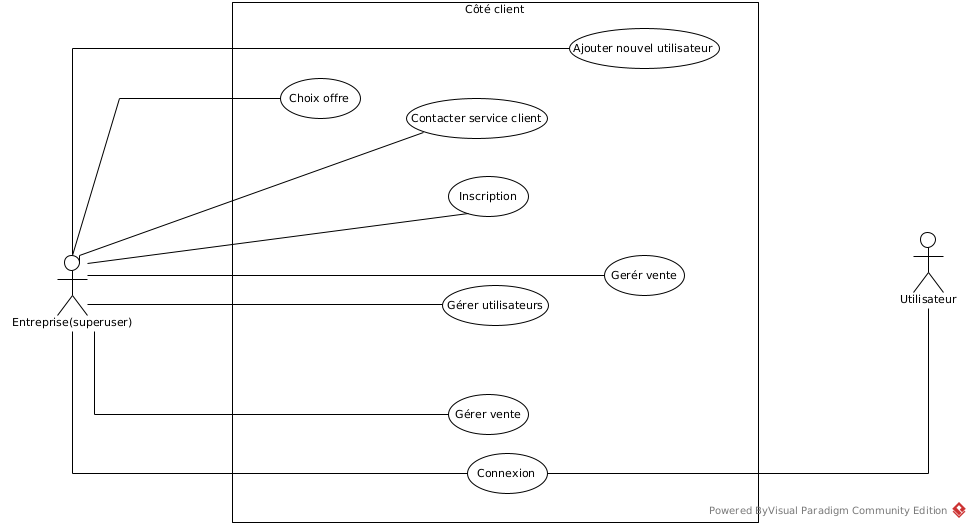
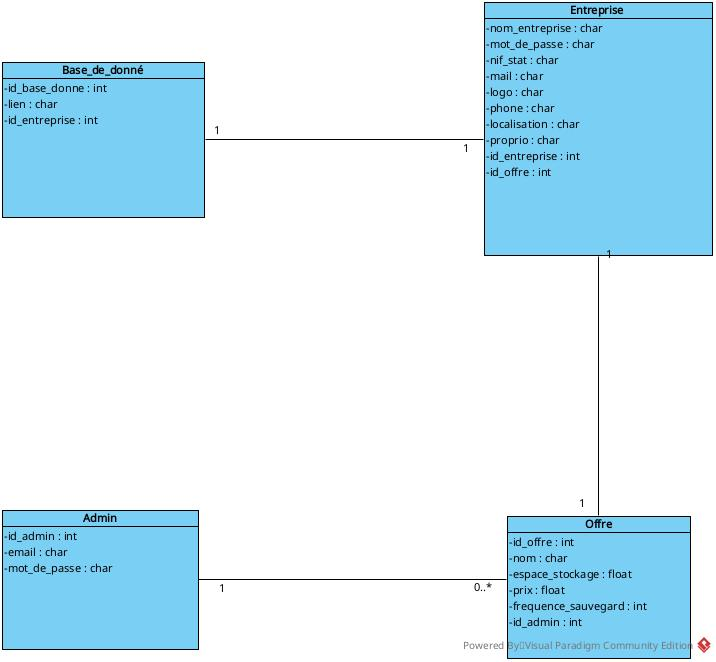
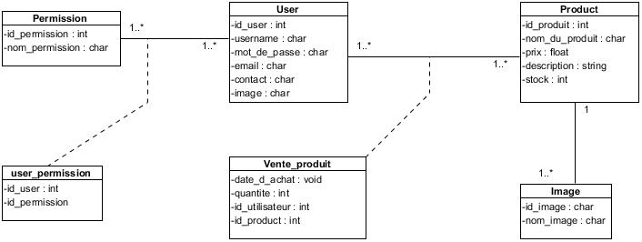

# Analyse des besoins

## Besoins fonctionnels :

### Connexion et gestion de compte :
- L'administrateur doit pouvoir se connecter à son compte en utilisant des identifiants sécurisés.
- Il doit pouvoir gérer les informations de son compte, comme la modification du mot de passe.
- Les entreprises clientes doivent pouvoir s'inscrire en fournissant les informations requises(nom de l'entreprise, mot de passe sécurisé, numéro d'identification fiscale/Statut, adresse e-mail valide, logo de l'entreprise, numéro de téléphone et des détails de localisation).
- Elles doivent pouvoir se connecter à leur compte en utilisant des identifiants sécurisés.

### Monitoring :
- L'administrateur doit disposer d'un tableau de bord convivial pour surveiller les activités de la plateforme.
- Il doit pouvoir suivre les entreprises clientes et les indicateurs clés, tels que l'utilisation du stockage.

### Service client :
- L'administrateur doit pouvoir entrer en contact avec les clients pour répondre à leurs demandes et leur fournir un support efficace.
- Les entreprises clientes doivent avoir accès à un support dédié pour obtenir de l'assistance ou poser des questions.

### Gestion de stock :
- La gestion des stocks est un aspect crucial pour les entreprises, leur permettant de contrôler et d'optimiser les niveaux de stock disponibles. Les entreprises clientes doivent pouvoir gérer leurs stocks efficacement. Le système devrait leur offrir des fonctionnalités telles que le suivi des quantités de produits, la création et la mise à jour des fiches produits, ainsi que des informations en temps réel sur les niveaux de stock. 

### Gestion de vente :
- Les entreprises peuvent gérer leurs ventes, notamment la création de factures et le suivi des transactions.

### Gestion des utilisateurs :
- Les entreprises doivent pouvoir gérer les utilisateurs autorisés à accéder à leur compte, en spécifiant leur rôle et leurs informations d'identification correspondantes.

## Besoins techniques :

### Sécurité :
- Le système doit utiliser des identifiants sécurisés pour la connexion et le stockage des informations sensibles.
- Des mesures de sécurité appropriées doivent être mises en place pour protéger les données des utilisateurs.

### Base de données :
- Chaque entreprise cliente doit disposer d'une base de données dédiée pour stocker les informations pertinentes de leur entreprise.

## Besoins d'utilisateurs :

### Expérience utilisateur conviviale :
- Le système doit offrir une interface conviviale pour faciliter la navigation et l'utilisation des fonctionnalités.

### Utilisabilité :
- Les entreprises clientes et l'administrateur doivent pouvoir utiliser facilement les différentes fonctionnalités du système, même sans expertise technique approfondie.

## Besoins non fonctionnels :

### Fiabilité :
- Le système doit être fiable, en minimisant les temps d'arrêt et en assurant une disponibilité élevée.

### Scalabilité :
- Le système doit être capable de s'adapter à la croissance des utilisateurs et des données, sans compromettre les performances.

# Conception et modélisation

## Diagramme de cas d'utilisation

## Diagrammes de classe

